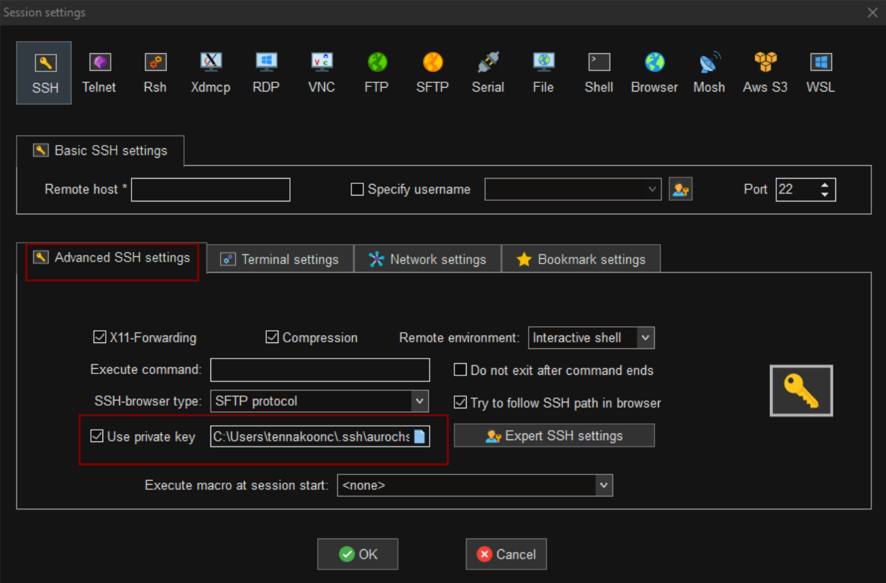

# Setting Up Passwordless SSH from Windows to the HPC (Aurochs)

This guide explains how to configure passwordless SSH access from a Windows machine to the Pirbright HPC (Aurochs).
The normal login procedure involves a password and a two-factor authentication code. The following setup will enable you to login to aurochs safely using an optional password, while retaining the same level of security. This will be useful for those who work in the high-containment area that will not have ready access to a phone.

---

# How Passwordless SSH Works 

When you normally log in to a remote server, you type your password every time.
With **passwordless SSH**, you don’t send your password at all. Instead, you use a pair of digital keys.
Your computer creates two related keys: A private and a public key.
The private key stays on your computer, and must **never be shared**. To guard against theft of this key, we protect it with a passphrase.
The Public Key can be safely revealed, and is added to the HPC. It is stored in the HPC in the file `~/.ssh/authorized_keys`.

## What Happens When You Connect?

When you ask to login with ssh from the windows machine, the private key is used to lock a certain cryptographic response, that can only be unlocked by the public key. The HPC recognizes this response by unlocking it with the public key stored at it's end the access is granted.
At no point is your password sent over the network.


## Why This Is More Secure

* Your password is never transmitted.
* The private key never leaves your machine.
* The server only accepts someone who can prove they own the matching private key.
* Even if someone copies your public key, it is useless without your private key.


## What the Passphrase Does

If you set a passphrase:

* It protects your private key if your computer is stolen.
* Without the passphrase, the private key cannot be used.
* It adds an extra layer of security.


This process is generally **more secure and more convenient**.

---

# Create Passwordless SSH
## Open PowerShell

On your Windows machine:

* Click **Start**
* Type **PowerShell**
* Open **Windows PowerShell**

---

## Generate a Dedicated SSH Key for Aurochs

Run the following command:

```powershell
ssh-keygen -t ed25519 -C "Windows SSH key" -f $env:USERPROFILE\.ssh\aurochs
```
This will create a key 


### What this does

It creates:

* A private key:

  ```
  C:\Users\yourusername\.ssh\aurochs
  ```

* A public key:

  ```
  C:\Users\yourusername\.ssh\aurochs.pub
  ```

---

### Set a Passphrase (Strongly Recommended)

You will be prompted:

```
Enter passphrase (empty for no passphrase):
```

We **strongly recommend** creating a secure passphrase to protect your private key.

---


## Add Your Public Key to the Aurochs Server

Run the following command (replace `username` with your HPC username):

```powershell
cat ~/.ssh/aurochs.pub | ssh username@aurochs.pirbright.ac.uk "cat >> ~/.ssh/authorized_keys && chmod 700 ~/.ssh && chmod 600 ~/.ssh/authorized_keys"
```

You will be prompted for your HPC password.

This command:

* Appends your public key to `~/.ssh/authorized_keys`
* Ensures correct permissions:

  * `~/.ssh` → `700`
  * `authorized_keys` → `600`

The hard part is done. After this step, passwordless login will be enabled. Now, we will see how to use these keys depending on the way you login to the cluster. When you connect to the HPC, you will only need to type the optional passphrase you have setup.

---

## Configure SSH for Easier Login
### Login with Mobaxterm
You will need to let Mobaxterm know the location of the private key. Goto the session settings, either by clicking on sessions button or right clicking an existing session and selecting edit session. In the **advanced ssh settings** tab, click *Use Private key*, and browse to select *C:/Users/username/.ssh/aurochs*. Once you click OK you can start login with passwordless ssh.  


### Login with Powershell

You can simply login to the HPC by typing `ssh username@aurochs.pirbright.ac.uk` from powershell. However, you can simplyfy this process even more. We will now create an SSH configuration file so you can log in using:

```powershell
ssh aurochs
```

---

#### Open the SSH Config File Using PowerShell ISE

Run:

```powershell
powershell_ise $env:USERPROFILE\.ssh\config
```

If the file does not exist, create it.

---

#### Add the Following Configuration

Replace `username` with your HPC username:

```
Host aurochs
    HostName aurochs.pirbright.ac.uk
    User username
    IdentityFile ~/.ssh/aurochs
```

Save the file.

---

#### Test Passwordless Login

Now test your connection:

```powershell
ssh aurochs
```

If configured correctly you will only be prompted for your optional passphrase:

---

## Troubleshooting

### Check the SSH folder

```powershell
ls ~/.ssh
```

You should see:

```
aurochs
aurochs.pub
config (if you set it up)
```

---

### Debug connection
If you are using a config file, type
```powershell
ssh -v aurochs
```

You should see:

```
Reading configuration data C:\Users\yourusername\.ssh\config
```

---

### If you see "Permission denied (publickey)"

* Ensure the public key was copied correctly
* Ensure no extra spaces were introduced
* Confirm your username is correct, it should be the HPC username


