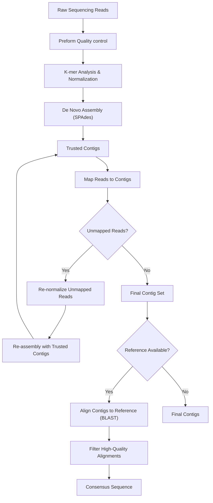

# Viral Genome Assembly Pipeline: Theory and Practical Usage

## Overview

The pipeline described here is designed to for a hybrid approach that combines de novo assembly with reference-guided refinement. It is implemented as a modular workflow that can be selectively configured and executed.

---

## Pipeline Workflow Diagram



***

## Challenges in Viral Genome Assembly

Viral sequencing datasets present several intrinsic difficulties. One of the most prominent is the extremely high sequencing depth, often several orders of magnitude higher than typical bacterial or eukaryotic datasets. While this may seem advantageous, it introduces substantial redundancy and amplifies sequencing noise, which can mislead assembly algorithms and increase computational burden.

Additionally, coverage across viral genomes is rarely uniform. Certain genomic regions may be overrepresented while others are underrepresented, which breaks the assumptions underlying many standard assembly heuristics. These irregularities can lead to fragmented assemblies or incorrect graph simplifications during contig construction.

Host contamination is another significant issue. Viral samples frequently include reads derived from the host organism, and removing these reads is not straightforward. Simple strategies that discard all reads mapping to the host genome risk eliminating genuine viral sequences, particularly when the host genome is incomplete or shares sequence similarity with viral regions.

Furthermore, sequencing artefacts such as chimeric reads can introduce false connections between unrelated genomic regions, resulting in mis-assemblies. Finally, viral populations often consist of quasi-species—closely related variants present at different frequencies—which complicates the distinction between true biological variation and sequencing error.

***

## Pipeline Design and Algorithmic Stages

To address these challenges, the pipeline is structured as a series of stages that progressively refine the sequencing data and assembly.

First, a quality control step is run where the reads are trimmed and if there are overlapping paired reads, fused into a single read. There is an option to select how many of these fused reads are finally passed onto the next step.

The process begins with a coverage normalization step based on K-mer analysis. Reads are decomposed into K-mers, and a mapping is constructed that associates each K-mer with the reads that contain it. K-mers are then sorted by frequency, and those occurring below a defined threshold are discarded, as they are likely to arise from sequencing errors. The algorithm then selects a bounded number of reads per K-mer, ensuring that no genomic region dominates the dataset due to excessive coverage. This produces a balanced and noise-reduced subset of reads, which significantly improves downstream assembly performance.

Following normalization, the pipeline performs de novo assembly using SPAdes. Rather than relying on a single assembly pass, the pipeline employs an iterative strategy. In each iteration, reads are assembled into contigs, which are stored as trusted contigs. The original reads are subsequently mapped back to these contigs, and reads that do not align are subjected to further rounds of normalization and assembly. This iterative process continues until no additional contigs can be generated or the remaining read set stabilizes. The final assembly step combines the original reads with all trusted contigs to produce a comprehensive set of de novo contigs.

Once contigs have been generated, the pipeline optionally uses a reference genome to guide the finishing stage. Contigs are aligned to the reference using BLAST, and only high-quality alignments are retained. These alignments are weighted by their coverage depth and used to construct a pileup, from which a consensus sequence is derived. Regions lacking coverage are represented with ambiguous bases (N’s). This step enables the ordering and orientation of contigs and helps resolve ambiguities that are difficult to address through de novo assembly alone.

The pipeline concludes with a variant-calling stage that refines the consensus sequence and identifies biologically meaningful variation. Reads are mapped back to the consensus, candidate variants are identified, and local re-alignment is performed to eliminate spurious mappings. Supported variants are incorporated into the consensus where appropriate, allowing the pipeline to capture both dominant and low-frequency variants within the viral population.

***

## Practical Usage of the Pipeline

### Environment Setup

Before running the pipeline, the required software environment must be loaded:

```bash
module load assembly/illumina_assembly 
```

Once analysis is complete, the environment can be reset using:

```bash
module unload assembly/illumina_assembly 
```

***

### Configuration File

The pipeline is controlled through a YAML configuration file that defines computational resources, input data, and assembly parameters.
The basic structure of the YAML file is given below:

```yaml
PROCESS:
  executor: this specifies the cluster manager, for Pirbright it would be slurm
  cpus: Number of processors to use 
JOB: This specifies a name for the assembly in the section described below, used to seperate multiple assembly jobs
  assembler:
      mode: this can be dna or rna 
      assembler: Name of the directory to place output for a given mode
      out_file: name of the spades assembly
      leveler_kmer: parameter for leveller
      stage_kmer:  parameter for leveller
      final_kmer:  parameter for leveller
  input_files:
      R1: Forward read file (absolute path)
      R2: Reverse read file (absolute path)
      max_reads: Number of reads to sample
      chimera_genome: path of the genome to use for chimeric filtering  (absolute path)
      reference_genome: refernce to use s a guide in finishing the assembly (absolute path)
      sample: Sample name 
  out_dir: Output directory
```

The `PROCESS` section specifies execution parameters such as the scheduler and CPUs. Each job defines an independent assembly run, and it will appear as the name of the job running in the SLURM. The mode can be `dna` or `rna`, and uses these modes of assembly in SPADES. Usually `rna` mode shows better results. The final output will be in `out_dir/sample/assembler` and will be named `out_file`. The `_kmer` parameters control the K-mer analysis parameters, and are best left as they are.
The `max_reads` parameter limits the number of reads passed to the assembler by selecting this many reads from extended read fragments. If chimera_genome, usually a close reference to the target virus, is provided, chimeric filtering is applied on the reads. Finally, if `reference_genome` is present, a reference guided assembly is attempted. 


#### Example Configuration

```yaml
---
PROCESS:
  executor: slurm
  cpus: 20

FMDV_0:
  assembler:
      assembler: staged_assembler_rna
      out_file: assembly.fasta
      mode: rna 
      leveler_kmer: 30
      stage_kmer: 31
      final_kmer: 55

  input_files:
      R1: /archive/tennakoon/BSP100/ERR2734404_1.fastq.gz
      R2: /archive/tennakoon/BSP100/ERR2734404_2.fastq.gz
      max_reads: 1200000
      chimera_genome: /ephemeral/tennakoon/virus_ref.fa
      reference_genome: /ephemeral/tennakoon/virus_ref.fa
      sample: fmdv_0 

  out_dir: /ephemeral/tennakoon/TEST
```

***

### Running the Pipeline

Run the full pipeline using:

```bash
runflow.sh --config template.yml --finisher 1 --variantcaller 1 --trimmer 1 --assembler 1 --stat 1
```

There are different stages that can be toggled. `trimmer` is the quality control step, `assembler` is the de-novo assembly step,  `finisher` is the construction of a consensus from a reference, `variantcaller` the step where variant calling is performed, and finally the `stat` where statistics are generated. It is recommended to not run the `variantcaller` as it is outdated. Placing a 1 will activate the module while a 0 will disable it.
To run only selected stages:

```bash
runflow.sh --config template.yml --finisher 0 --variantcaller 0 --trimmer 1 --assembler 1 --stat 0
```

This modular design allows flexibility for testing, debugging, or partial analyses.

***

## Conclusion

This viral genome assembly pipeline combines robust algorithmic strategies with practical usability. By integrating coverage normalization, iterative assembly, and reference-guided refinement, it effectively overcomes the unique challenges of viral sequencing data. 

